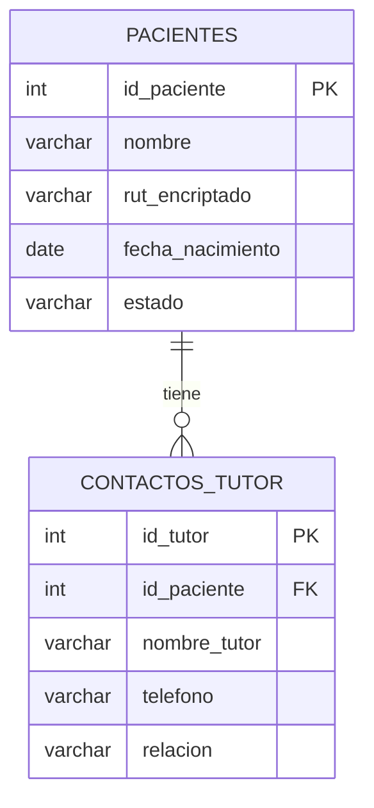

# Arquitectura del Sistema - ERP Veterinaria

> **Autor:** @Arquitecto  
> **Entorno:** Windows Local / SQL Server  
> **Última actualización:** Ver `/docs/CHANGELOG.md`

---

## Diagrama General del Sistema

```mermaid
graph TD
    UI[Frontend / UI Clínica] -->|HTTP/REST| API[/src/api - Endpoints]
    API --> SVC[/src/services - Lógica de Negocio]
    SVC --> DB[(SQL Server)]
    SVC --> AUTH[Validación RUT + Encriptación]
```

---

## Modelo de Datos (Base)



---

## Índices de Performance (SQL Server)

```sql
-- Búsquedas de pacientes < 200ms
CREATE INDEX IX_Pacientes_RUT ON Pacientes(rut_encriptado);
CREATE INDEX IX_Pacientes_Nombre ON Pacientes(nombre);
```

---

## Principios de Seguridad

- **RUT:** Almacenado encriptado en DB (AES-256). Nunca en texto plano.
- **Diagnósticos:** Campo `diagnostico_enc` siempre encriptado.
- **Queries:** 100% parametrizadas — sin concatenación de strings.

---

*Este documento es completado y mantenido por @Arquitecto.*

